```
██████  ██    ██ ██   ██ ███    ███ ███████
██   ██  ██  ██   ██ ██  ████  ████ ██     
██████    ████     ███   ██ ████ ██ █████  
██         ██     ██ ██  ██  ██  ██ ██     
██         ██    ██   ██ ██      ██ ███████
```
# Pyxme - Pixel Art Converter

Convert any image into pixel art with predefined color palettes from classic gaming systems.

## Features

- **Palettes** from NES, Game Boy, C64, PICO-8, and more
- **Pixelation engine** with adjustable block sizes
- **Color quantization** with optional Floyd-Steinberg dithering
- **Image adjustments** including brightness, contrast, saturation, and sharpening
- **Edge enhancement** for preserving important details

## Installation

```bash
pip install .
```

## Quick Start

```bash
# Use default preset
pyxme input.jpg output.png

# Try different presets
pyxme input.jpg output.png --preset nes
pyxme input.jpg output.png --preset gameboy
pyxme input.jpg output.png --preset pico8
```

## Usage

### Basic Command

```bash
pyxme <input> <output> [options]
```

### Presets

Use `--list-presets` to see all available configurations:

```bash
pyxme --list-presets
```

Available presets:
- `cool` - Vibrant retro pixel art (default)

  

- `nes` - NES/Famicom authentic palette

  

- `gameboy` - Game Boy green monochrome

  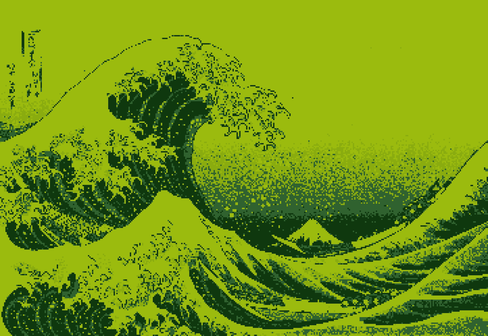

- `pico8` - PICO-8 fantasy console

  

- `c64` - Commodore 64 classic

  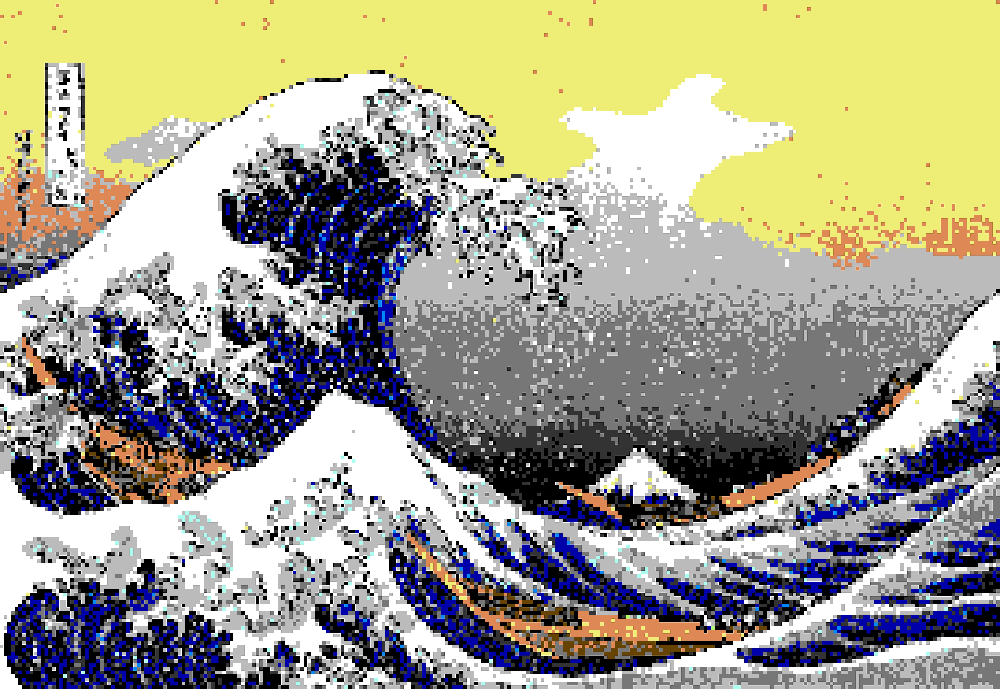

- `cga` - CGA 16-color graphics

  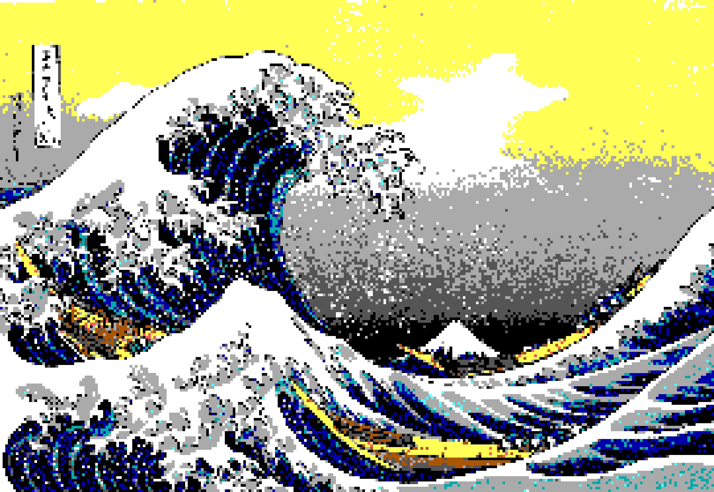

- `retro` - Classic 8-bit game style

  

- `modern` - Modern pixel art with detail

  

- `extreme` - Maximum retro chunky style

  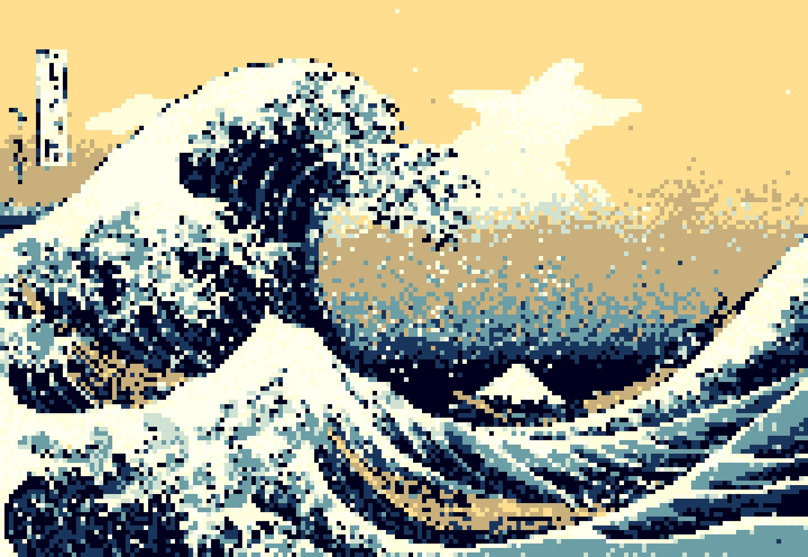

- `arcade` - Bright arcade cabinet style

  

- `apollo` - Apollo synthwave palette

  

### Color Palettes

Use `--list-palettes` to see all authentic retro palettes:

```bash
pyxme --list-palettes
```

Apply a specific palette:

```bash
pyxme input.jpg output.png --palette nes
pyxme input.jpg output.png --palette commodore64
pyxme input.jpg output.png --palette gameboy
```

Available palettes:
- `nes` - Nintendo Entertainment System (54 colors)
 
  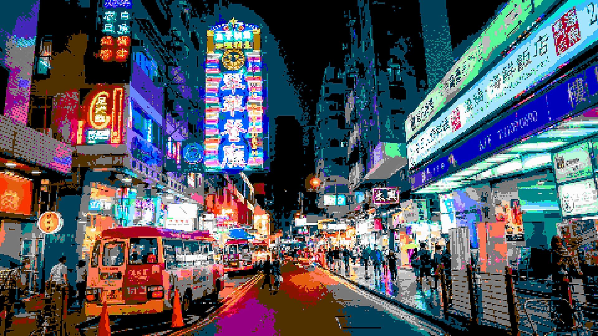

- `gameboy` - Game Boy green (4 colors)

  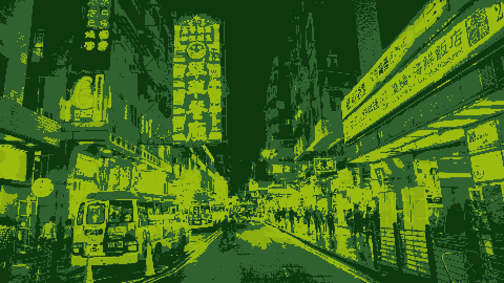

- `gameboy_pocket` - Game Boy Pocket grayscale (4 colors)

  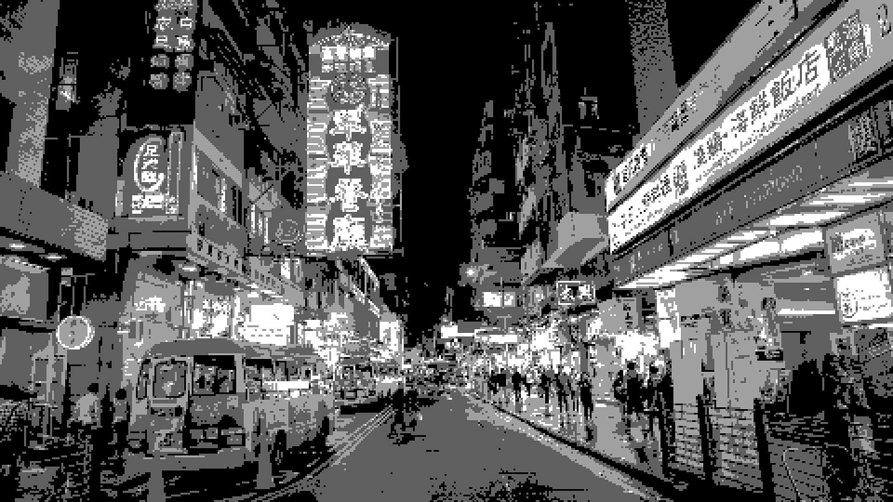

- `pico8` - PICO-8 (16 colors)

  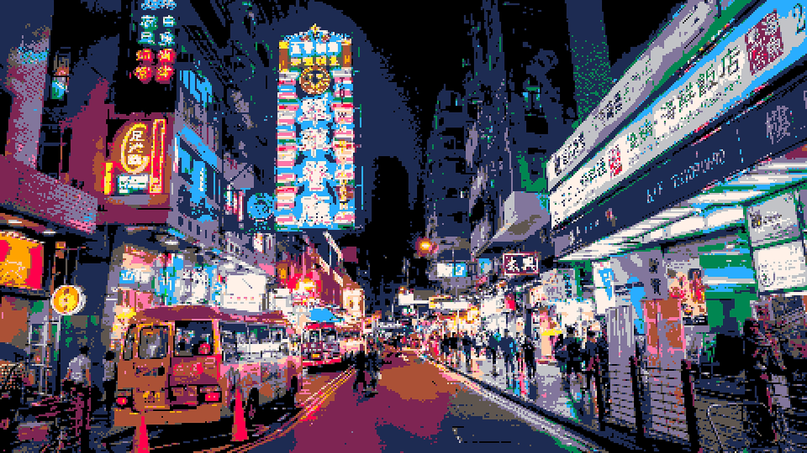

- `commodore64` - Commodore 64 (16 colors)
  
  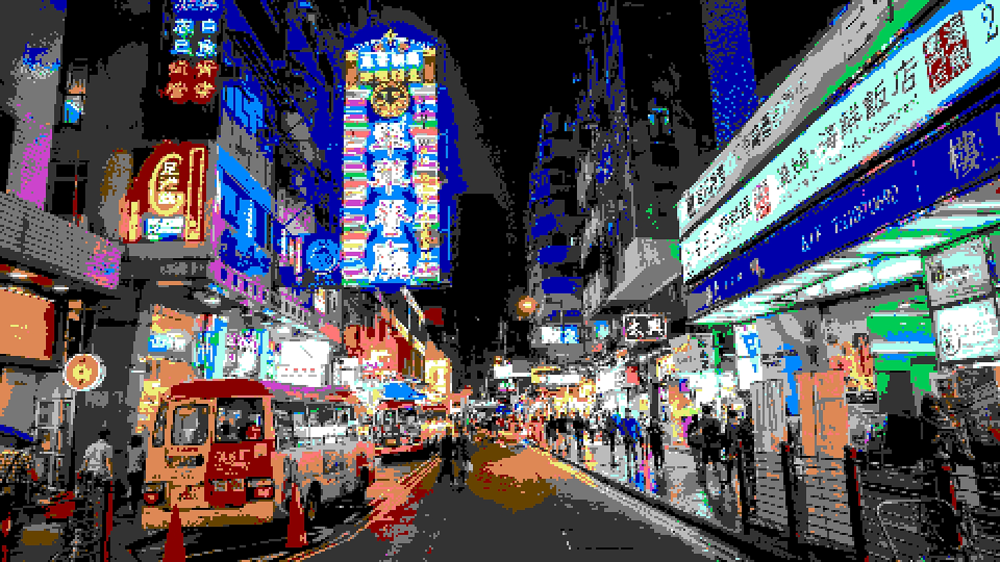

- `cga` - IBM CGA (16 colors)
  
  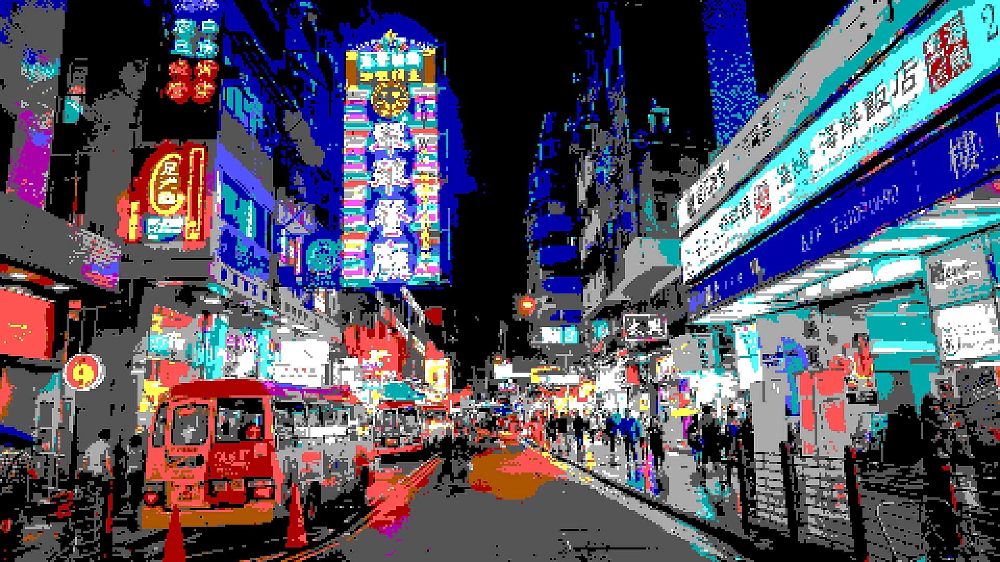

- `gameboy_color` - Game Boy Color (12 colors)
  
  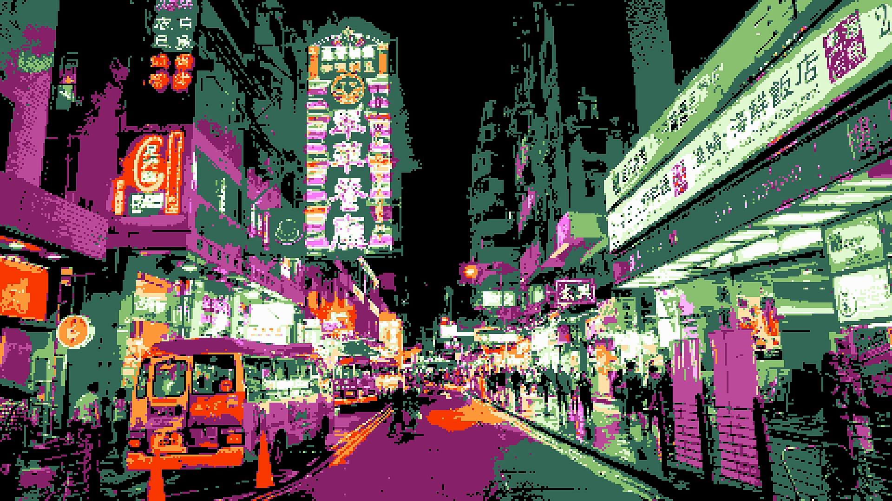

- `apollo` - Synthwave palette (16 colors)
  
  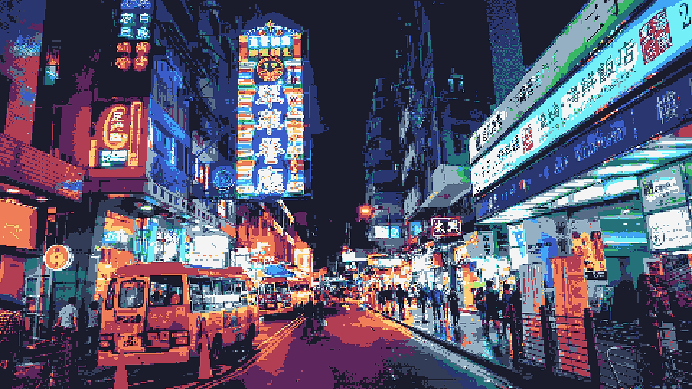

- `ega` - IBM EGA (64 colors)
  
  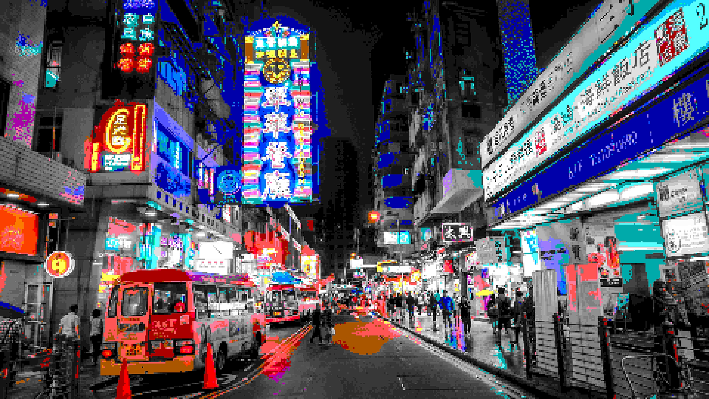

- `msx` - MSX computer (16 colors)
  
  

**Note:**
Original photo by [Y K](https://unsplash.com/@yokeboy?utm_source=unsplash&utm_medium=referral&utm_content=creditCopyText) on [Unsplash](https://unsplash.com/photos/people-on-street-beside-building-during-nighttime-7XWXiF3ZxDg?utm_source=unsplash&utm_medium=referral&utm_content=creditCopyText)

### Custom Parameters

Override preset values with custom parameters:

```bash
pyxme input.jpg output.png \
  --preset retro \
  --pixel-size 20 \
  --colors 16 \
  --brightness 0.85 \
  --contrast 1.4 \
  --saturation 1.3 \
  --sharpen 2.5
```

### Options

#### Basic Parameters
- `-p, --pixel-size` - Pixel block size (higher = more pixelated)
- `-c, --colors` - Number of colors (4-256, lower = more retro)
- `-b, --brightness` - Brightness factor (0.0-2.0, default: 1.0)
- `--contrast` - Contrast factor (0.0-2.0, default: 1.0)
- `-s, --saturation` - Saturation factor (0.0-2.0, default: 1.0)
- `--sharpen` - Sharpness factor (1.0-5.0, higher = crisper)

#### Enhancement Flags
- `--dither` - Enable Floyd-Steinberg dithering (authentic retro look)
- `--edge-enhance` - Enhance edges before pixelation (sharper details)
- `--clean-palette` - Use aggressive palette snapping (cleaner colors)

## Examples

### NES Style
```bash
pyxme photo.jpg nes_art.png --preset nes --dither
```

### Game Boy Green Screen
```bash
pyxme photo.jpg gameboy.png --preset gameboy
```

### PICO-8 Fantasy Console
```bash
pyxme photo.jpg pico8.png --preset pico8
```

### Custom Heavy Pixelation
```bash
pyxme photo.jpg chunky.png -p 24 -c 8 --sharpen 3.0
```

### Preserve Fine Details
```bash
pyxme photo.jpg detailed.png -p 6 -c 64 --edge-enhance
```

### Synthwave Aesthetic
```bash
pyxme photo.jpg synthwave.png --preset apollo
```

### CGA with Dithering
```bash
pyxme photo.jpg cga_dither.png --palette cga --dither -p 16
```


